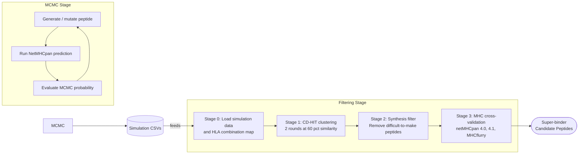

# Super-HLA Analysis Pipeline

Super-HLA is a modular computational pipeline for discovering **super-binder peptides** — peptides that bind strongly to a broad set of MHC class I HLA supertypes. The pipeline is split into two independently runnable stages:

| Stage | Directory | Status |
|-------|-----------|--------|
| 1. MCMC Simulation | [`mcmc/`](mcmc/) | ✅ Available |
| 2. Filtering | [`filtering/`](filtering/) | ✅ Available |

Each stage has its own `README.md` with detailed run instructions and flowcharts. This document covers the one-time setup and the big-picture architecture.

---

## 🏗️ Big-Picture Architecture



The MCMC stage stochastically explores peptide space, accepting mutations that improve broad HLA binding.  After many independent simulation runs, the filtering stage consolidates all accepted peptides into a final ranked candidate list.

---

## 🛠️ One-Time Setup

### 1. Python Environment

This project requires **Python 3.10+**.

```bash
# Create a virtual environment
python3.10 -m venv .venv
source .venv/bin/activate        # macOS / Linux
# .\.venv\Scripts\Activate.bat  # Windows (WSL required for netMHCpan)

pip install -U pip
pip install -r requirements.txt
```

> [!NOTE]
> Make sure your IDE debugger/interpreter is also pointed to this `.venv`.

### 2. Configure `.env`

Create or edit the `.env` file at the project root.  The file ships with commented-out templates for all variables.

**Minimum required for MCMC:**

```env
# Path to your netMHCpan directory (4.1 or 4.2 supported)
MHC_DIR_PATH=/path/to/netMHCpan-4.2/
```

**Additional variables required for Filtering:**

```env
ROBUST_DF_CSV_PATH=/path/to/all_data_frames_sims_october.csv
SIMULATION_CSV_DIR=/path/to/semi-strict-october-40000/
HLA_COMBINATIONS_PICKLE=/path/to/all_hla_cominations.pickle
MEMOIZATION_DIR=/path/to/memoization/
CDHIT_CLUSTER1_INPUT_DIR=/path/to/cd-hit-files/cluster1/
CDHIT_CLUSTER1_OUTPUT_DIR=/path/to/cd-hit-files/cluster1/output/
CDHIT_CLUSTER2_INPUT_DIR=/path/to/cd-hit-files/cluster2/
CDHIT_CLUSTER2_OUTPUT_DIR=/path/to/cd-hit-files/cluster2/output/
STAGE2_OUTPUT_DIR=/path/to/stage2-files/
```

### 3. External Tools

| Tool | Required by | How to install |
|------|-------------|----------------|
| `netMHCpan 4.1` or `4.2` | MCMC + Filtering | [DTU Health Tech](https://services.healthtech.dtu.dk/) |
| `netMHCpan 4.0` | Filtering stage 3 only | Same DTU page (optional) |
| `cd-hit` | Filtering stage 1 | `brew install cd-hit` |
| `mhcflurry` | Filtering stage 3 | `pip install mhcflurry && mhcflurry-downloads fetch` |

> [!IMPORTANT]
> On **Windows**, netMHCpan requires WSL.  Open the project in VSCode from inside WSL and use the macOS-style setup above.

---

## 🚀 Running the Pipeline

### Run MCMC only

```bash
python mcmc/main.py --mode random --seed 9 --accepted 2
```

See [`mcmc/README.md`](mcmc/README.md) for the full CLI reference.

### Run Filtering only

```bash
python filtering/main.py
```

See [`filtering/README.md`](filtering/README.md) for the filtering flowchart and env var reference.

---

## 📁 Project Structure

```
super-HLA/
├── .env                   ← All environment variable configuration
├── requirements.txt
├── README.md              ← You are here (setup + big picture)
│
├── mcmc/
│   ├── README.md          ← MCMC-specific docs and flowchart
│   ├── main.py
│   ├── simulation.py
│   ├── pipeline.py
│   ├── analysis.py
│   ├── parameters.py
│   └── config.py
│
└── filtering/
    ├── README.md          ← Filtering-specific docs and flowchart
    ├── main.py
    ├── config.py
    ├── constants.py
    ├── stage0_load_data.py
    ├── stage1_cdhit_clustering.py
    ├── stage2_filter_synthesis.py
    ├── stage3_validate_mhc_predictions.py
    └── utils/
        ├── fasta.py
        ├── memoize.py
        ├── clustering.py
        ├── scoring.py
        └── prediction.py
```
