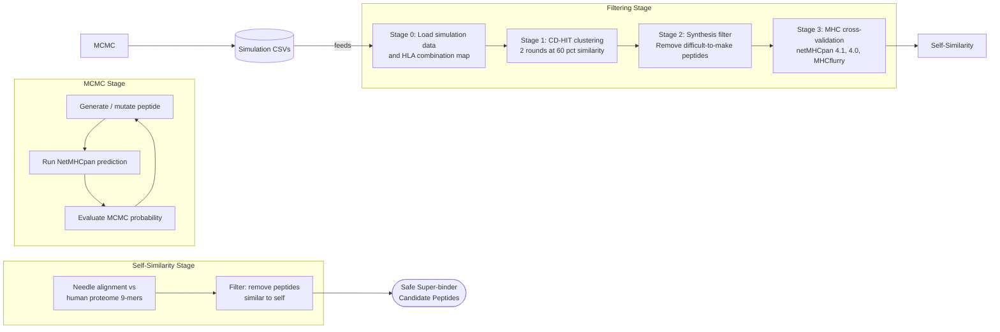

# Super-HLA Analysis Pipeline

Super-HLA is a modular computational pipeline for discovering **super-binder peptides** — peptides that bind strongly to a broad set of MHC class I HLA supertypes. The pipeline is split into three independently runnable stages:

| Stage | Directory | Description |
|-------|-----------|-------------|
| 1. MCMC Simulation | [`mcmc/`](mcmc/) | Stochastic peptide space exploration via Markov Chain Monte Carlo |
| 2. Filtering | [`filtering/`](filtering/) | Progressive filtering and cross-validation of candidates |
| 3. Self-Similarity | [`filtering/self_similarity/`](self_similarity/) | Remove candidates that resemble human proteome peptides |

Each stage has its own `README.md` with detailed run instructions and flowcharts. This document covers the one-time setup and the big-picture architecture.

---

## Big-Picture Architecture



The MCMC stage stochastically explores peptide space, accepting mutations that improve broad HLA binding. The filtering stage consolidates all accepted peptides into a ranked candidate list. The self-similarity stage removes candidates that are too similar to naturally occurring human peptides — a critical safety check for vaccine/immunotherapy applications.

---

## Validate Your Setup

Before running anything, check that all prerequisites are in place:

```bash
python validate_setup.py
```

This checks Python version, virtual environment, pip packages, `.env` paths, external tools (netMHCpan, cd-hit, Docker, MHCflurry), and reports what's missing. You can also import it programmatically:

```python
from validate_setup import validate
report = validate()
if report["all_ok"]:
    print("Ready to go!")
```

---

## One-Time Setup

### Automated Setup (Recommended)

**macOS:**
```bash
chmod +x setup_mac.sh
./setup_mac.sh
```

**Windows** (via WSL):
```powershell
# First, install WSL (one-time, run PowerShell as Administrator):
wsl --install

# Then open WSL and navigate to the project:
wsl
cd /mnt/c/Users/<you>/code/super-HLA

# Run setup:
chmod +x setup_windows.sh
./setup_windows.sh
```

Both scripts install all prerequisites, configure `.env`, and are idempotent (safe to re-run).

> **Windows users:** Always run the pipeline from WSL, not from PowerShell. Your project files at `/mnt/c/...` are shared between Windows and WSL.

### Manual Setup

#### 1. Python Environment

This project requires **Python 3.10+**.

**macOS / Linux:**
```bash
python3.10 -m venv .venv
source .venv/bin/activate
pip install -U pip && pip install -r requirements.txt
```

**Windows (inside WSL):**
```bash
python3 -m venv .venv
source .venv/bin/activate
pip install -U pip && pip install -r requirements.txt
```

#### 2. External Tools

| Tool | Required by | macOS | Windows (via WSL) |
|------|-------------|-------|-------------------|
| `netMHCpan 4.1` | MCMC + Filtering | [DTU Health Tech](https://services.healthtech.dtu.dk/) | Same (Linux binary runs in WSL) |
| `netMHCpan 4.0` | Filtering stage 3 | Same DTU page | Same (Linux binary runs in WSL) |
| `cd-hit` | Filtering stage 1 | `brew install cd-hit` | `wsl sudo apt install cd-hit` |
| `mhcflurry` | Filtering stage 3 | `pip install mhcflurry && mhcflurry-downloads fetch` | Same |
| `Docker` | macOS, for netMHCpan | [Docker Desktop](https://www.docker.com/products/docker-desktop/) | Not needed (WSL used instead) |
| `needle` (EMBOSS) | Self-similarity | `brew install emboss` | `wsl sudo apt install emboss` |
| `noncoding_9mers.fasta` | Self-similarity (stage 4) | Human proteome chopped to 9-mers (~16 GB) | Same file, set `HUMAN_9MERS_FASTA` in `.env` |
| `WSL` | Windows only | N/A | `wsl --install` (as Administrator) |

### macOS on Apple Silicon (arm64) -- Platform Notes

netMHCpan does not ship native arm64 macOS binaries. This pipeline handles it automatically with platform-specific wrappers:

| Version | Available binary | Solution |
|---------|-----------------|----------|
| **netMHCpan 4.1** | macOS x86_64 | Runs via **Rosetta 2**. A `netMHCpan_darwin_arm64` wrapper script runs the x86_64 binary through `arch -x86_64`. Created automatically during setup. |
| **netMHCpan 4.0** | Linux x86_64 only | Runs via **Docker**. A `netMHCpan_docker` wrapper script runs the Linux binary inside a lightweight Debian container. Requires Docker Desktop to be running. |

The pipeline auto-detects these wrappers -- if a `netMHCpan_docker` or `netMHCpan_darwin_arm64` script exists in the netMHCpan directory, it is used instead of the default tcsh wrapper.

**Setting up netMHCpan 4.1 on arm64 Mac:**

1. Download `netMHCpan-4.1b.Darwin.tar.gz` from DTU and extract into your netMHCpan-4.1 directory.
2. Create a `Darwin_arm64` symlink pointing to `Darwin_x86_64`:
   ```bash
   cd /path/to/netMHCpan-4.1
   ln -s Darwin_x86_64 Darwin_arm64
   ```
3. Create the Rosetta wrapper (`netMHCpan_darwin_arm64`):
   ```bash
   cat > netMHCpan_darwin_arm64 << 'EOF'
   #!/bin/bash
   NMHOME="$(cd "$(dirname "$0")" && pwd)"
   PLATFORM="Darwin_x86_64"
   export NETMHCpan="$NMHOME/$PLATFORM"
   /usr/bin/arch -x86_64 "$NETMHCpan/bin/netMHCpan" -rdir "$NETMHCpan" "$@"
   EOF
   chmod +x netMHCpan_darwin_arm64
   ```

**Setting up netMHCpan 4.0 via Docker:**

1. Download `netMHCpan-4.0a.Linux.tar.gz` from DTU and extract.
2. Download the data files (they are separate):
   ```bash
   cd /path/to/netMHCpan-4.0
   curl -O https://services.healthtech.dtu.dk/services/NetMHCpan-4.0/data.Linux.tar.gz
   tar -xzf data.Linux.tar.gz
   ```
3. Build the Docker image:
   ```bash
   docker build --platform linux/amd64 -t netmhcpan40 .
   ```
   The `Dockerfile` is included in the netMHCpan-4.0 directory.
4. The `netMHCpan_docker` wrapper script is also included and will be auto-detected by the pipeline.
5. Make sure Docker Desktop is running before executing the pipeline.

### Windows with WSL -- Platform Notes

On Windows, the entire pipeline runs inside **WSL (Windows Subsystem for Linux)**. No Docker is required — Linux binaries run natively.

**Setup:**
1. Install WSL (PowerShell as Administrator): `wsl --install`
2. Open WSL, navigate to project: `cd /mnt/c/Users/<you>/code/super-HLA`
3. Run: `./setup_windows.sh` — this installs everything via `apt` and creates a `netMHCpan_wsl` wrapper

**Running:** Always use WSL (not PowerShell) to run the pipeline. Your Windows files are accessible at `/mnt/c/...`.

The pipeline auto-detects the platform and uses the appropriate wrapper (Docker on macOS, native binary on WSL).

#### 3. Configure `.env`

Create or edit the `.env` file at the project root.

**Minimum required for MCMC:**

```env
MHC_DIR_PATH=/path/to/netMHCpan-4.1/
```

**Additional variables for Filtering** are automatically configured by `filtering.prepare_data` (see below), or can be set manually:

```env
ACCEPTED_PEPTIDES_CSV_PATH=/path/to/accepted_peptides.csv
SIMULATION_CSV_DIR=/path/to/mcmc/output/
HLA_COMBINATIONS_PICKLE=/path/to/all_hla_combinations.pickle
MEMOIZATION_DIR=/path/to/memoization/
CDHIT_CLUSTER1_INPUT_DIR=/path/to/cd-hit/cluster1/input/
CDHIT_CLUSTER1_OUTPUT_DIR=/path/to/cd-hit/cluster1/output/
CDHIT_CLUSTER2_INPUT_DIR=/path/to/cd-hit/cluster2/input/
CDHIT_CLUSTER2_OUTPUT_DIR=/path/to/cd-hit/cluster2/output/
SYNTHESIS_FILTER_OUTPUT_DIR=/path/to/stage2-files/

# Cross-validation predictor (stage 3)
NETMHCPAN_40_DIR_PATH=/path/to/netMHCpan-4.0/

# Self-similarity analysis (stage 4) — REQUIRED for running stage 4
HUMAN_9MERS_FASTA=/path/to/noncoding_9mers.fasta  # Human proteome 9-mers (~16 GB)
# HUMAN_PROTEOME_FASTA=/path/to/human_proteome.fasta  # Only if generating 9-mers from scratch
```

---

## Running the Pipeline

### Quick Start — Pipeline Orchestrator

The easiest way to run the full pipeline is the interactive orchestrator:

```bash
python run.py
```

This gives you an interactive menu with a status dashboard showing which stages have been completed, what's currently running, and what's pending. You can also use it non-interactively:

```bash
python run.py --status      # Show pipeline status
python run.py --run-all     # Run all stages (skips completed ones)
python run.py --stage 1     # Run a specific stage
python run.py --stage 1 --seeds 1,2,3 --accepted 100  # MCMC with options
```

### Manual Execution

You can also run each stage individually:

### Step 1: Run MCMC simulations

```bash
# Run multiple seeds (each produces mcmc/output/<seed>.csv)
python mcmc/main.py --mode random --seed 1 --accepted 100
python mcmc/main.py --mode random --seed 2 --accepted 100
python mcmc/main.py --mode random --seed 3 --accepted 100
```

See [`mcmc/README.md`](mcmc/README.md) for the full CLI reference.

### Step 2: Prepare filtering data

After running one or more MCMC seeds, bridge the gap to the filtering stage:

```bash
python -m filtering.prepare_data
```

This script:
1. Combines all per-seed CSVs into a single `accepted_peptides.csv`
2. Builds the HLA combination mapping pickle
3. Updates `.env` with the correct paths

### Step 3: Run filtering pipeline

```bash
python -m filtering.main
```

See [`filtering/README.md`](filtering/README.md) for the filtering flowchart and configuration reference.

### Step 4: Self-similarity analysis

Check that candidate peptides are not too similar to naturally occurring human peptides:

```bash
python -m filtering.self_similarity.main
```

This uses EMBOSS `needle` (Needleman-Wunsch global alignment) to compare each candidate 9-mer peptide from stage 3 against all 9-mers from the human proteome. Peptides with high similarity or identity to human self-peptides are removed — a critical safety check for vaccine/immunotherapy applications.

**Required data file:** `noncoding_9mers.fasta` — the full human proteome chopped into overlapping 9-mer peptides (~16 GB, ~149M sequences). Set the path in `.env`:

```env
HUMAN_9MERS_FASTA=/path/to/noncoding_9mers.fasta
```

This file is the reference that candidate peptides are compared against. Without it, stage 4 cannot run.

**Using pre-computed results:** If you already have an `alignment_results.json` (from a previous run), place it at `data/needle/alignment_results.json` or pass it directly. Note: pre-computed results must match your current candidates — stale results from a different set of peptides will be detected and skipped.

```bash
python -m filtering.self_similarity.main --precomputed /path/to/alignment_results.json
```

**Running fresh:** Fresh needle alignments are compute-intensive (each candidate is aligned against all ~149M human 9-mers). For a small number of candidates (e.g. 7) this takes minutes; for hundreds it can take hours/days.

See [`self_similarity/README.md`](self_similarity/README.md) for full details.

---

## Project Structure

```
super-HLA/
├── .env                        <- All environment variable configuration
├── run.py                      <- Pipeline orchestrator (interactive + CLI)
├── setup_mac.sh                <- macOS automated setup (Homebrew + Docker)
├── setup_windows.sh            <- Windows/WSL automated setup (apt-based)
├── requirements.txt
├── validate_setup.py           <- Pre-flight check for all prerequisites
├── README.md                   <- You are here (setup + big picture)
│
├── mcmc/
│   ├── README.md               <- MCMC-specific docs and flowchart
│   ├── main.py                 <- CLI entry point
│   ├── simulation.py           <- MCMC loop orchestrator
│   ├── pipeline.py             <- Peptide generation, mutation, netMHCpan calls
│   ├── analysis.py             <- NetMHCpan output parsing & feature engineering
│   ├── parameters.py           <- MCMC acceptance probability function
│   └── config.py               <- .env loader + constants
│
├── filtering/
│   ├── README.md               <- Filtering-specific docs and flowchart
│   ├── main.py                 <- Orchestration entry point
│   ├── config.py               <- .env loader
│   ├── constants.py            <- HLA supertypes, thresholds, amino acids
│   ├── stage0_load_data.py     <- Load MCMC results + HLA combination map
│   ├── stage1_cdhit_clustering.py <- Two-round CD-HIT sequence clustering
│   ├── stage2_filter_synthesis.py <- Rule-based synthesis difficulty filter
│   ├── stage3_validate_mhc_predictions.py <- MHC prediction cross-validation
│   └── utils/
│       ├── fasta.py            <- FASTA file writer
│       ├── memoize.py          <- Pickle-based result caching
│       ├── clustering.py       <- CD-HIT .clstr output parser
│       ├── scoring.py          <- Binding score helpers + DataFrame loaders
│       └── prediction.py       <- MHC predictor wrappers (netMHCpan + MHCflurry)
│   │
│   └── self_similarity/        <- Stage 4: Self-similarity (separate CLI stage due to high compute cost)
│       ├── README.md            <- Self-similarity docs and usage
│       ├── main.py              <- CLI entry point + orchestrator
│       ├── config.py            <- .env loader for self-similarity settings
│       ├── chopper.py           <- 9-mer sliding window FASTA chopper
│       ├── needle_runner.py     <- Parallel EMBOSS needle alignment runner
│       ├── parse_results.py     <- Parse needle output → structured JSON/DataFrame
│       └── filter_self.py       <- Apply similarity thresholds → safe peptide list
│
└── data/                       <- Generated at runtime (git-ignored)
    ├── accepted_peptides.csv
    ├── all_hla_combinations.pickle
    ├── memoization/
    ├── cd-hit/
    ├── stage2-files/
    └── needle/                 <- Self-similarity analysis data
        ├── alignment_results.json
        ├── chunks/             <- Chunked reference peptidome
        └── output/             <- Per-peptide needle output files
```
