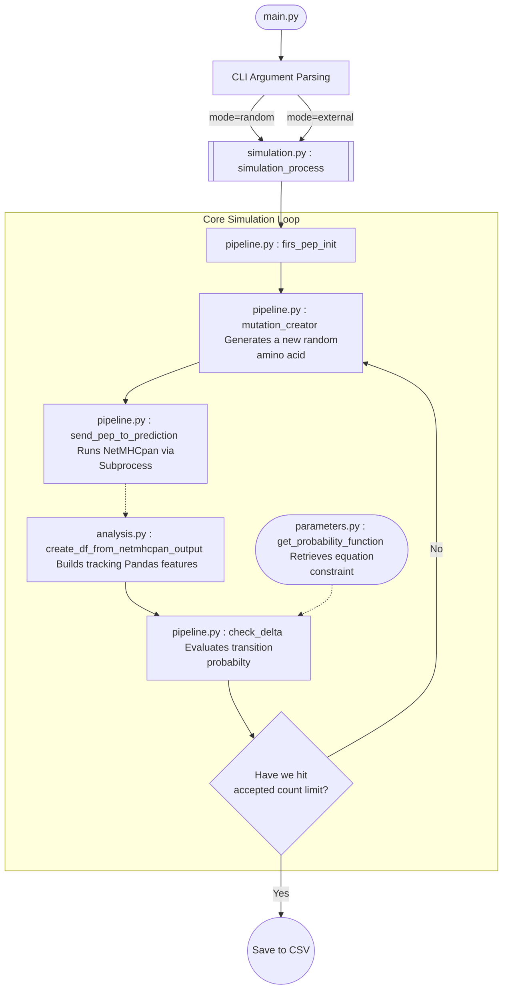

# Refactored Filtering Algorithm Pipeline

This acts as a modular, type-safe, and configurable alternative to the original thesis pipeline. It eliminates hardcoded variables in the source code, introduces a Pythonic project structure, and safely handles NetMHCpan predictions under the hood.

## 🛠️ Environment Configuration

Before running any script, you must configure your `.env` file at the root of the project. The pipeline reads this file automatically.

### Required Environment Variables

```env
# Path to your NetMHCpan directory. Crucial for executions.
# The pipeline automatically handles both 4.1 and 4.2 output formats based on this path!
MHC_DIR_PATH=/path/to/netMHCpan-4.2/

# Optional Overrides (They have defaults)
# INPUT_DIR_PATH=/path/to/input/directory
# OUTPUT_DIR_PATH=/path/to/output/directory
# HLA_STR=HLA-A01:01,HLA-A02:01...
# SUPERTYPES_LIST=HLA-A*01:01,HLA-A*02:01...
```

## 🚀 How to Run

Instead of manually editing and uncommenting lines of python code, the new pipeline uses a robust CLI (Command Line Interface).

1. Change directory to the refactored pipeline:
   ```bash
   cd /path/to/your/project/refactored-pipeline
   ```
2. Make sure you activate your python virtual environment.

**Run a Random Peptide Simulation:**
```bash
python main.py --mode random --seed 9 --accepted 2
```

**Run an External FASTA Peptide List Simulation:**
```bash
python main.py --mode external --seed 9 --fasta ../input/peptides_for_pred_9.txt --accepted 2
```

### CLI Arguments Breakdown

- `--mode`: Either `random` (generates random amino acids) or `external` (reads from FASTA file).
- `--seed`: The integer seed used for the MCMC simulation randomness.
- `--fasta`: (Only required if `--mode external`) Path to the FASTA list.
- `--accepted`: Stop target for the Markov Chain model (default is 2).
- `--output`: Choose a custom directory to dump the resulting `.csv`.

---

## 🏗️ Architecture & Flowchart

The refactored code splits large complex monoliths into cleanly separated domains. Here is exactly how data flows across all functions.



### Module Breakdown:

1. `main.py`: Purely dictates command line interfaces. Initiates the execution logic.
2. `simulation.py`: Handles the high-level `while` loop that controls the MCMC (Markov Chain Monte Carlo) acceptance states.
3. `pipeline.py`: A wrapper toolkit executing physical tasks. Includes generating peptides, executing the physical `netMHCpan` shell binaries, and checking the exact probability deltas.
4. `analysis.py`: Contains strictly pandas DataFrame logic to extract statistics (such as `WB`, `SB`, `NB`) out of the raw text outputs from NetMHCpan.
5. `parameters.py`: Small isolated utility storing the mathematical equations that constrain the probability.
6. `config.py`: Acts as the bridge between your system's `.env` and Python.
