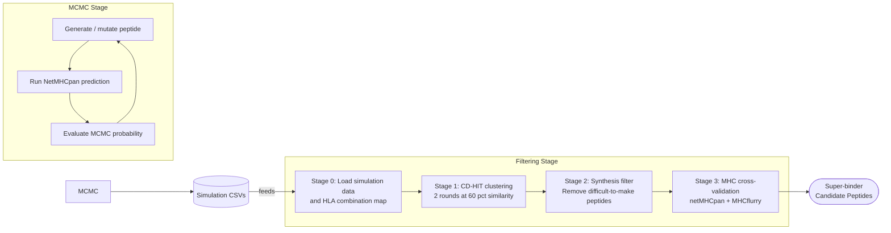

# Super-HLA Analysis Pipeline

Super-HLA is a modular computational pipeline for discovering **super-binder peptides** — peptides that bind strongly to a broad set of MHC class I HLA supertypes. The pipeline is split into two independently runnable stages:

| Stage | Directory | Description |
|-------|-----------|-------------|
| 1. MCMC Simulation | [`mcmc/`](mcmc/) | Stochastic peptide space exploration via Markov Chain Monte Carlo |
| 2. Filtering | [`filtering/`](filtering/) | Progressive filtering and cross-validation of candidates |

Each stage has its own `README.md` with detailed run instructions and flowcharts. This document covers the one-time setup and the big-picture architecture.

---

## Big-Picture Architecture



The MCMC stage stochastically explores peptide space, accepting mutations that improve broad HLA binding. After many independent simulation runs, the filtering stage consolidates all accepted peptides into a final ranked candidate list.

---

## One-Time Setup

### 1. Python Environment

This project requires **Python 3.10+**.

```bash
# Create a virtual environment
python3.10 -m venv .venv
source .venv/bin/activate        # macOS / Linux

pip install -U pip
pip install -r requirements.txt
```

### 2. External Tools

| Tool | Required by | How to install |
|------|-------------|----------------|
| `netMHCpan 4.1` or `4.2` | MCMC + Filtering | [DTU Health Tech](https://services.healthtech.dtu.dk/) (requires registration) |
| `cd-hit` | Filtering stage 1 | `brew install cd-hit` (macOS) |
| `netMHCpan 4.0` | Filtering stage 3 (optional) | Same DTU page |
| `mhcflurry` | Filtering stage 3 (optional) | `pip install mhcflurry && mhcflurry-downloads fetch` |

> **Note:** On **Windows**, netMHCpan requires WSL. Open the project inside WSL and use the macOS-style setup above.

### 3. Configure `.env`

Create or edit the `.env` file at the project root. The file ships with commented-out templates for all variables.

**Minimum required for MCMC:**

```env
MHC_DIR_PATH=/path/to/netMHCpan-4.2/
```

**Additional variables for Filtering** are automatically configured by `prepare_filtering_data.py` (see below), or can be set manually:

```env
ROBUST_DF_CSV_PATH=/path/to/robust_df.csv
SIMULATION_CSV_DIR=/path/to/mcmc/output/
HLA_COMBINATIONS_PICKLE=/path/to/all_hla_combinations.pickle
MEMOIZATION_DIR=/path/to/memoization/
CDHIT_CLUSTER1_INPUT_DIR=/path/to/cd-hit/cluster1/input/
CDHIT_CLUSTER1_OUTPUT_DIR=/path/to/cd-hit/cluster1/output/
CDHIT_CLUSTER2_INPUT_DIR=/path/to/cd-hit/cluster2/input/
CDHIT_CLUSTER2_OUTPUT_DIR=/path/to/cd-hit/cluster2/output/
STAGE2_OUTPUT_DIR=/path/to/stage2-files/

# Optional: for cross-validation in stage 3
NETMHCPAN_40_DIR_PATH=/path/to/netMHCpan-4.0/
```

---

## Running the Pipeline

### Step 1: Run MCMC simulations

```bash
# Run multiple seeds (each produces mcmc/output/<seed>.csv)
python mcmc/main.py --mode random --seed 1 --accepted 100
python mcmc/main.py --mode random --seed 2 --accepted 100
python mcmc/main.py --mode random --seed 3 --accepted 100
```

See [`mcmc/README.md`](mcmc/README.md) for the full CLI reference.

### Step 2: Prepare filtering data

After running one or more MCMC seeds, bridge the gap to the filtering stage:

```bash
python prepare_filtering_data.py
```

This script:
1. Combines all per-seed CSVs into a single `robust_df.csv`
2. Builds the HLA combination mapping pickle
3. Updates `.env` with the correct paths

### Step 3: Run filtering pipeline

```bash
python -m filtering.main
```

See [`filtering/README.md`](filtering/README.md) for the filtering flowchart and configuration reference.

---

## Project Structure

```
super-HLA/
├── .env                        <- All environment variable configuration
├── requirements.txt
├── prepare_filtering_data.py   <- Bridges MCMC output to filtering input
├── README.md                   <- You are here (setup + big picture)
│
├── mcmc/
│   ├── README.md               <- MCMC-specific docs and flowchart
│   ├── main.py                 <- CLI entry point
│   ├── simulation.py           <- MCMC loop orchestrator
│   ├── pipeline.py             <- Peptide generation, mutation, netMHCpan calls
│   ├── analysis.py             <- NetMHCpan output parsing & feature engineering
│   ├── parameters.py           <- MCMC acceptance probability function
│   └── config.py               <- .env loader + constants
│
├── filtering/
│   ├── README.md               <- Filtering-specific docs and flowchart
│   ├── main.py                 <- Orchestration entry point
│   ├── config.py               <- .env loader
│   ├── constants.py            <- HLA supertypes, thresholds, amino acids
│   ├── stage0_load_data.py     <- Load MCMC results + HLA combination map
│   ├── stage1_cdhit_clustering.py <- Two-round CD-HIT sequence clustering
│   ├── stage2_filter_synthesis.py <- Rule-based synthesis difficulty filter
│   ├── stage3_validate_mhc_predictions.py <- MHC prediction cross-validation
│   └── utils/
│       ├── fasta.py            <- FASTA file writer
│       ├── memoize.py          <- Pickle-based result caching
│       ├── clustering.py       <- CD-HIT .clstr output parser
│       ├── scoring.py          <- Binding score helpers + DataFrame loaders
│       └── prediction.py       <- MHC predictor wrappers (netMHCpan + MHCflurry)
│
└── data/                       <- Generated at runtime (git-ignored)
    ├── robust_df.csv
    ├── all_hla_combinations.pickle
    ├── memoization/
    ├── cd-hit/
    └── stage2-files/
```
