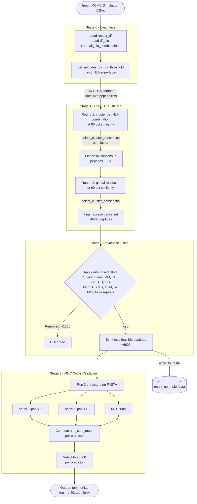

# Filtering Pipeline — Super-HLA

This module implements the **four-stage peptide filtering pipeline** that takes raw MCMC simulation output and progressively narrows it down to a high-confidence set of super-binder candidates.

> [!NOTE]
> **Prerequisite:** The MCMC stage must have been run first and produced simulation output CSVs. Configure all filtering `.env` variables before running.

---

## 🔄 Pipeline Overview

The filtering pipeline takes ~10 000s of peptides produced by the MCMC simulation and reduces them to a few thousand high-confidence HLA super-binders through four sequential stages:



---

## ⚙️ Configuration

All paths are configured via the root `.env` file. Copy the commented-out variables from `.env` and fill in your actual paths:

| Variable | Description |
|----------|-------------|
| `ROBUST_DF_CSV_PATH` | Path to `all_data_frames_sims_october.csv` |
| `SIMULATION_CSV_DIR` | Directory of per-seed MCMC simulation CSVs |
| `HLA_COMBINATIONS_PICKLE` | Path to `all_hla_cominations.pickle` |
| `MEMOIZATION_DIR` | Root directory for all pickle caches |
| `CDHIT_CLUSTER1_INPUT_DIR` | FASTA input dir for cluster round 1 |
| `CDHIT_CLUSTER1_OUTPUT_DIR` | CD-HIT output dir for cluster round 1 |
| `CDHIT_CLUSTER2_INPUT_DIR` | FASTA input dir for cluster round 2 |
| `CDHIT_CLUSTER2_OUTPUT_DIR` | CD-HIT output dir for cluster round 2 |
| `STAGE2_OUTPUT_DIR` | Directory for stage 2 FASTA output |
| `NETMHCPAN_40_DIR_PATH` | Path to netMHCpan 4.0 binary directory |

---

## 🚀 How to Run

```bash
python filtering/main.py
```

The pipeline will print progress and counts after each stage. Memoized results are loaded from the `MEMOIZATION_DIR` automatically — re-runs only recompute what's missing.

### Expected Progress (original dataset)

| Stage | Output Count |
|-------|-------------|
| Stage 0 — Threshold peptides | ~471 HLA combinations |
| Stage 1 Round 1 — Flat consensus | ~55 066 peptides |
| Stage 1 Round 2 — Representatives | ~8 435 rows |
| Stage 2 — Synthesis-feasible | ~6 599 peptides |
| Stage 3 — Top 3000 per predictor | 3 000 × 3 lists |

---

## 📁 Module Breakdown

```
filtering/
├── main.py                       # Orchestration entry point
├── config.py                     # .env loader → Python constants
├── constants.py                  # Shared scientific constants (HLA list, thresholds)
├── stage0_load_data.py           # Load MCMC output and HLA combination map
├── stage1_cdhit_clustering.py    # Two-round CD-HIT sequence clustering
├── stage2_filter_synthesis.py    # Rule-based synthesis difficulty filter
├── stage3_validate_mhc_predictions.py  # MHC binding cross-validation
└── utils/
    ├── fasta.py                  # FASTA file writer
    ├── memoize.py                # Pickle-based result caching
    ├── clustering.py             # CD-HIT .clstr output parser
    ├── scoring.py                # Binding score helpers + DataFrame loaders
    └── prediction.py             # MHC predictor wrappers (netMHCpan + MHCflurry)
```

---

## 🔧 External Tool Requirements

| Tool | Used in | Install |
|------|---------|---------|
| `cd-hit` | Stage 1 | `brew install cd-hit` (macOS) |
| `netMHCpan 4.1` | Stage 3 | [DTU download page](https://services.healthtech.dtu.dk/) |
| `netMHCpan 4.0` | Stage 3 | Same DTU page (optional, for cross-validation) |
| `mhcflurry` | Stage 3 | `pip install mhcflurry && mhcflurry-downloads fetch` |

---

## 🗒️ Known TODOs

- **Stage 3 — Cross-predictor intersection**: The original analysis selected peptides that ranked in the top N across *all three* predictors simultaneously. This logic was incomplete in the legacy code and is marked as a `TODO` in `stage3_validate_mhc_predictions.py`.
