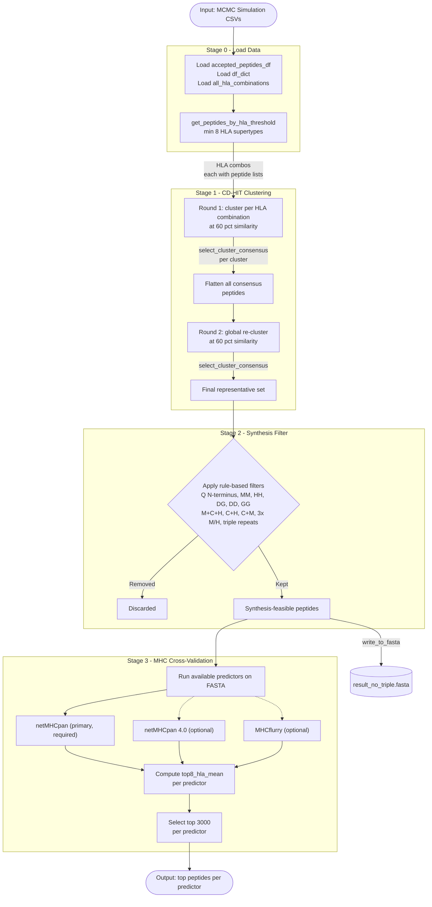

# Filtering Pipeline -- Super-HLA

This module implements the **four-stage peptide filtering pipeline** that takes raw MCMC simulation output and progressively narrows it down to a high-confidence set of super-binder candidates.

> **Prerequisite:** The MCMC stage must have been run first and `filtering.prepare_data` must have been run to set up the filtering inputs. See the main [README.md](../README.md) for the full workflow.

---

## Pipeline Overview

The filtering pipeline takes peptides produced by the MCMC simulation and reduces them to a few thousand high-confidence HLA super-binders through four sequential stages:



---

## Configuration

All paths are configured via the root `.env` file. Most paths are set automatically by `filtering.prepare_data`.

| Variable | Description |
|----------|-------------|
| `ACCEPTED_PEPTIDES_CSV_PATH` | Path to combined MCMC results CSV |
| `SIMULATION_CSV_DIR` | Directory of per-seed MCMC simulation CSVs |
| `HLA_COMBINATIONS_PICKLE` | Path to HLA combination mapping pickle |
| `MEMOIZATION_DIR` | Root directory for all pickle caches |
| `CDHIT_CLUSTER1_INPUT_DIR` | FASTA input dir for cluster round 1 |
| `CDHIT_CLUSTER1_OUTPUT_DIR` | CD-HIT output dir for cluster round 1 |
| `CDHIT_CLUSTER2_INPUT_DIR` | FASTA input dir for cluster round 2 |
| `CDHIT_CLUSTER2_OUTPUT_DIR` | CD-HIT output dir for cluster round 2 |
| `SYNTHESIS_FILTER_OUTPUT_DIR` | Directory for synthesis filter FASTA output |
| `NETMHCPAN_40_DIR_PATH` | Path to netMHCpan 4.0 (optional, for cross-validation) |

---

## How to Run

```bash
python -m filtering.main
```

The pipeline will print progress and counts after each stage. Memoized results are loaded from `MEMOIZATION_DIR` automatically -- re-runs only recompute what's missing. Delete the memoization directory to force a full re-run.

### Expected Progress (original dataset)

| Stage | Output Count |
|-------|-------------|
| Stage 0 -- Threshold peptides | ~471 HLA combinations |
| Stage 1 Round 1 -- Flat consensus | ~55,066 peptides |
| Stage 1 Round 2 -- Representatives | ~8,435 rows |
| Stage 2 -- Synthesis-feasible | ~6,599 peptides |
| Stage 3 -- Top 3000 per predictor | 3,000 x N predictors |

---

## Module Breakdown

```
filtering/
├── main.py                       # Orchestration entry point
├── config.py                     # .env loader -> Python constants
├── constants.py                  # Shared scientific constants (HLA list, thresholds)
├── stage0_load_data.py           # Load MCMC output and HLA combination map
├── stage1_cdhit_clustering.py    # Two-round CD-HIT sequence clustering
├── stage2_filter_synthesis.py    # Rule-based synthesis difficulty filter
├── stage3_validate_mhc_predictions.py  # MHC binding cross-validation
└── utils/
    ├── fasta.py                  # FASTA file writer
    ├── memoize.py                # Pickle-based result caching
    ├── clustering.py             # CD-HIT .clstr output parser
    ├── scoring.py                # Binding score helpers + DataFrame loaders
    └── prediction.py             # MHC predictor wrappers (netMHCpan + MHCflurry)
```

---

## External Tool Requirements

| Tool | Used in | Install |
|------|---------|---------|
| `cd-hit` | Stage 1 | `brew install cd-hit` (macOS) |
| `netMHCpan 4.1 or 4.2` | Stage 3 (primary) | [DTU download page](https://services.healthtech.dtu.dk/) |
| `netMHCpan 4.0` | Stage 3 (optional) | Same DTU page |
| `mhcflurry` | Stage 3 (optional) | `pip install mhcflurry && mhcflurry-downloads fetch` |

Stage 3 requires the primary netMHCpan installation (configured via `MHC_DIR_PATH`). netMHCpan 4.0 and MHCflurry are optional -- if not configured or installed, those predictors are automatically skipped with a warning.
