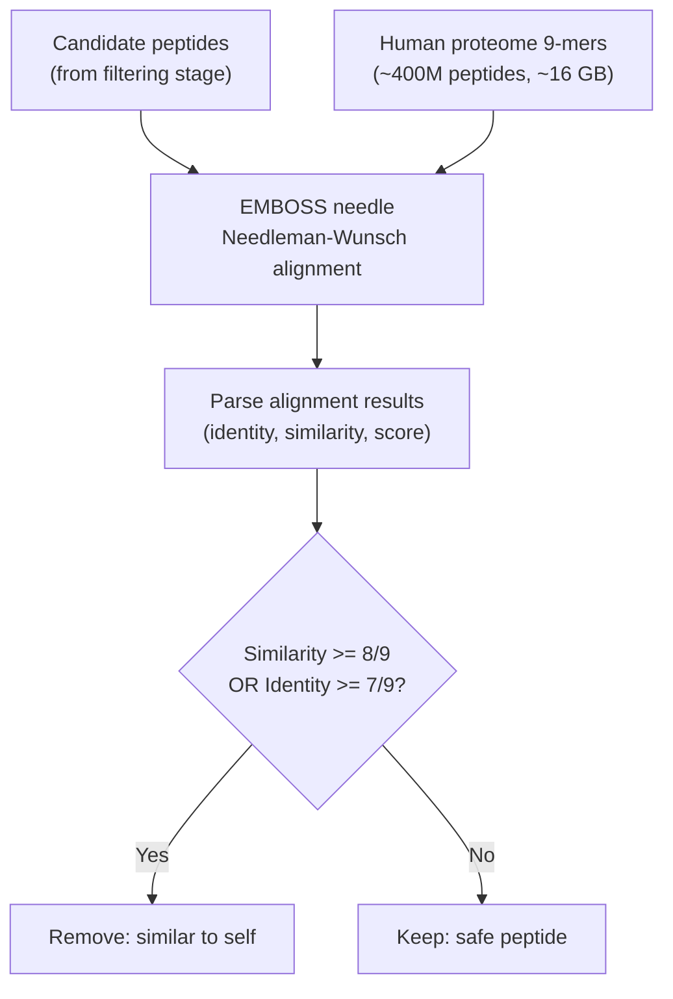

# Self-Similarity Analysis

This stage checks whether candidate super-binder peptides are too similar to naturally occurring human peptides. Peptides that closely match the human proteome could trigger immune tolerance instead of a desired immune response, or worse, cause autoimmune reactions.

## How It Works



1. **Reference peptidome**: The entire human proteome (from [OpenProt](https://openprot.org/) — including reference proteins, alternative proteins, and isoforms) is chopped into overlapping 9-mers. This produces ~400 million 9-mer peptides (~16 GB FASTA file).

2. **Needle alignment**: Each candidate peptide is globally aligned against every reference 9-mer using EMBOSS `needle` with extreme gap penalties (`-gapopen 100 -gapextend 10`) to force ungapped full-length alignment. Only hits with identity >= 6/9 are retained.

3. **Self-similarity filter**: Peptides with **similarity >= 8/9** or **identity >= 7/9** to any human 9-mer are flagged as "similar to self" and removed from the candidate list.

## Usage

### Using pre-computed results (recommended)

If you have `alignment_results.json` from a previous run:

```bash
# Place it in the default location
cp /path/to/alignment_results.json data/needle/

# Run analysis
python -m filtering.self_similarity.main
```

Or pass it directly:

```bash
python -m filtering.self_similarity.main --precomputed /path/to/alignment_results.json
```

### Running fresh needle alignments

This requires:
- EMBOSS needle installed (`brew install emboss`)
- A reference peptidome (either pre-chopped 9-mers or a full human proteome FASTA)

```bash
# Set paths in .env
HUMAN_9MERS_FASTA=/path/to/noncoding_9mers.fasta

# Run (WARNING: extremely slow — hours/days for 100 peptides)
python -m filtering.self_similarity.main --candidates data/candidate_peptides.fasta
```

### Programmatic usage

```python
from filtering.self_similarity.main import run_self_similarity

# With a list of peptide sequences
result = run_self_similarity(
    candidate_peptides=["ALFPHIMTY", "KLFPHFYRF", ...],
    precomputed_json="data/needle/alignment_results.json",
)

print(f"Safe: {len(result['safe_peptides'])}")
print(f"Removed: {len(result['removed_peptides'])}")
```

## Configuration (.env)

| Variable | Description | Required |
|----------|-------------|----------|
| `HUMAN_9MERS_FASTA` | Pre-chopped human proteome 9-mers (~16 GB) | For fresh runs |
| `HUMAN_PROTEOME_FASTA` | Full human proteome FASTA | Alternative to above |
| `NEEDLE_CHUNKS_DIR` | Chunked 9-mer files for parallel processing | Auto-created |
| `NEEDLE_OUTPUT_DIR` | Per-peptide needle output files | Auto-created |
| `ALIGNMENT_RESULTS_JSON` | Parsed alignment results | Auto-created |
| `CANDIDATE_PEPTIDES_FASTA` | Input candidate peptides FASTA | Auto-created |
| `SELF_SIM_SIMILARITY_THRESHOLD` | Similarity threshold (default: 8) | Optional |
| `SELF_SIM_IDENTITY_THRESHOLD` | Identity threshold (default: 7) | Optional |
| `NEEDLE_WORKERS` | Parallel processes for needle (default: CPU count) | Optional |

## Output

The analysis produces three output files in `data/needle/`:

- **`safe_peptides.fasta`** — Candidate peptides that passed the self-similarity filter
- **`removed_self_similar.txt`** — Peptide sequences that were removed
- **`self_similarity_summary.json`** — Full summary with counts and thresholds

## Performance Notes

- Fresh needle runs are **extremely compute-intensive**. The old codebase ran these on a Linux server, split into 10 parallel batches, each processing 10 peptides against chunked FASTA files.
- The reference peptidome file (`noncoding_9mers.fasta`) is ~16 GB. It only needs to be generated once.
- Pre-computed `alignment_results.json` files are small (~2 MB) and should be preserved.
- The needle runner supports **resume** — if you stop and restart, already-completed peptides are skipped.
