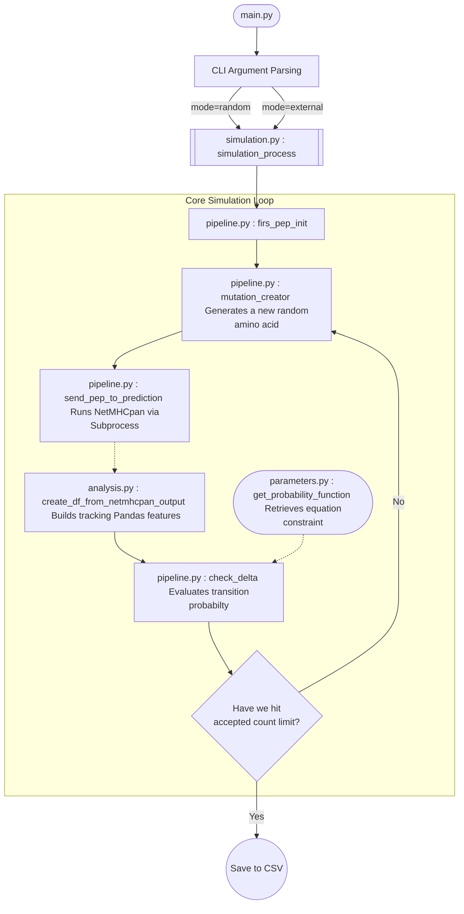

# MCMC Simulation — Super-HLA

This module implements the **Markov Chain Monte Carlo (MCMC)** simulation that is the first step in the super-HLA peptide discovery pipeline. It can be run **completely independently** — it has no dependency on the filtering stage.

## 🚀 How to Run

**Run a Random Peptide Simulation:**

```bash
python mcmc/main.py --mode random --seed 9 --accepted 2
```

**Run an External FASTA Peptide List Simulation:**

```bash
python mcmc/main.py --mode external --seed 9 --fasta mcmc/input/peptides_for_pred_9.txt --accepted 2
```

### CLI Arguments

| Argument   | Description |
|------------|-------------|
| `--mode`   | `random` (generates a random peptide) or `external` (reads from FASTA file). |
| `--seed`   | Integer seed used for MCMC simulation randomness. |
| `--fasta`  | *(Required if `--mode external`)* Path to the input peptide FASTA file. |
| `--accepted` | Stop target — how many accepted MCMC steps to collect (default: `2`). |
| `--output` | Optional. Custom directory to dump the resulting `.csv`. |

### Output

The simulation produces a `.csv` file (one row per accepted peptide) in the `mcmc/output/` directory (configurable via the `OUTPUT_DIR_PATH` env var).

---

## 🏗️ Architecture & Flowchart



## 📁 Module Breakdown

| File | Role |
|------|------|
| `main.py` | CLI entry point. Parses arguments and kicks off execution. |
| `simulation.py` | High-level `while` loop controlling MCMC acceptance states. |
| `pipeline.py` | Physical task executor: generates peptides, calls netMHCpan, checks deltas. |
| `analysis.py` | Pandas logic to extract WB/SB/NB statistics from netMHCpan output. |
| `parameters.py` | Mathematical probability function constraining the Markov Chain. |
| `config.py` | Bridge between the root `.env` file and Python constants. |
